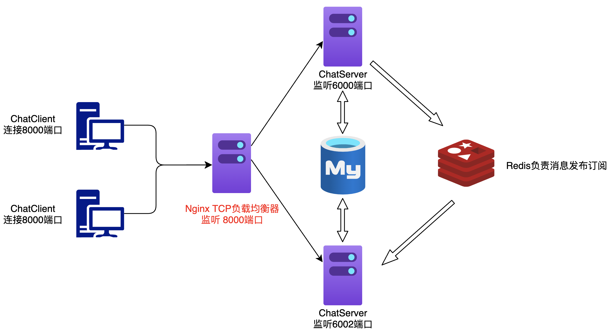
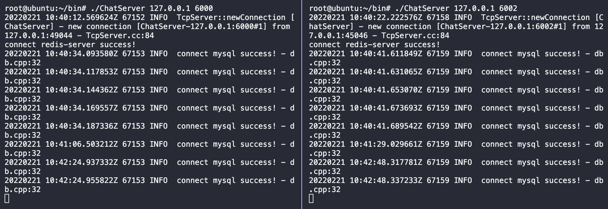

## 项目介绍
采用 [muduo](https://github.com/chenshuo/muduo) 处理网络连接请求及事件回调，在单机环境中模拟启动两个客户端，通过`Nginx`的`TCP`长连接负载均衡器将连接均衡至两台启动的服务器中（详见下方`/usr/local/nginx/conf/nginx.conf`配置选项），`Redis`发布订阅对服务器之间的消息进行转发。




#### 服务器示例
两台服务器启动，分别绑定`6000`、`6002`端口


#### 客户端示例
两台客户端连接`nginx`负载均衡器监听的`8000`端口，并进行通信


#### 功能
* [x] **用户登录**
* [x] **用户注销**
* [x] **注册用户**
* [x] **单人聊天**
* [x] **添加好友**
* [x] **创建群组**
* [x] **加入群组**
* [x] **群组聊天**

#### 编译

进入目录执行`./build.sh`即可编译完成。


## 开发环境

- linux kernel version 4.4.0 (ubuntu 16.04 Server)
- gcc version 5.4.0
- cmake version 3.5.1
- boost version 1.58
- mysql version 5.7
- redis version 3.0.6
- [muduo version 2.0.2](https://github.com/chenshuo/muduo/releases/tag/v2.0.2)
- [json version 3.6.1](https://github.com/nlohmann/json/releases/tag/v3.6.1)
- [nginx version 1.12.2](http://nginx.org/download/nginx-1.12.2.tar.gz)
- [hiredis version 1.0.2](https://github.com/redis/hiredis)


### muduo配置

[muduo](https://github.com/chenshuo/muduo) 编译依赖`gcc`、`cmake`、`boost`

```sh
# 安装cmake
sudo apt-get install cmake

# 安装boost
sudo apt-get install libboost-dev libboost-test-dev

# 三个非必须依赖库：curl、c-ares DNS、Google Protobuf
sudo apt-get install libcurl4-openssl-dev libc-ares-dev
sudo apt-get install protobuf-compiler libprotobuf-dev
```

[muduo](https://github.com/chenshuo/muduo) 依赖安装完毕，编译`./build.sh`，若仍然缺少依赖，尝试：

```sh
sudo apt-get update
sudo apt-get install -y build-essential
```

编译完毕后执行 [muduo](https://github.com/chenshuo/muduo) 编译安装，生成`release-install-cpp11`文件：
```sh
./build.sh install
```

`release-install-cpp11`文件夹下有两个文件夹`include`和`lib`，先把编译生成`include`下的`muduo`文件夹移动至`/usr/include/`中，再把`lib`下四个库`libmuduo_base.a` `libmuduo_http.a` `libmuduo_inspect.a` `libmuduo_net.a`移动至`/usr/local/lib/`中：

```sh
mv muduo/ /usr/include/     # 把release-install-cpp11/include/*移动到/usr/include/
mv * /usr/local/lib/        # 把release-install-cpp libmuduo_base.a  libmuduo_http.a  libmuduo_inspect.a  libmuduo_net.a四个库拷贝到/usr/local/lib/
```


### MySQL配置

安装`mysql 5.7`及开发包：
```sh
apt-get update
apt-get install mysql-server  # 安装最新版MySQL服务器
apt-get install libmysqlclient-dev  # 安装开发包
```

* `MySQL`连接账号密码设置见`chatserver/src/server/db/db.cpp`
* 数据库操作细节参考：[link](https://zhuanlan.zhihu.com/p/115534006)
* 出现登录错误参考：[link](https://blog.csdn.net/weixin_42507981/article/details/113292645)

### Redis配置

安装`Redis`服务器：

```sh
apt-get install redis-server
```

* `Redis`初始化及服务启动操作可参考：[link](https://segmentfault.com/a/1190000019408555)

#### Redis发布订阅客户端配置

`Redis`支持多种不同的客户端编程语言，如`Java`对应`jedis`、`php`对应`phpredis`、`C++`对应 [hiredis](https://github.com/redis/hiredis)。下面是安装`hiredis`的步骤，编译前先切换至`root`用户：

```sh
git clone https://github.com/redis/hiredis
cd hiredis
make
make install
ldconfig /usr/local/lib  # 拷贝生成的动态库至/usr/local/lib
```


### NginxTCP负载均衡配置

编译`nginx`前，需安装依赖环境`pcre`、`zlib`、`openssl`。`PCRE`库支持正则表达式。若在配置文件`nginx.conf`中使用了正则表达式，在编译`nginx`时就必须把`PCRE`库编译进`nginx`。安装`PCRE`：

```sh
sudo apt-get install libpcre3 libpcre3-dev  
```

`zlib`库用于对`HTTP`包的内容做`gzip`格式的压缩，若在`nginx.conf`中配置了`gzip on`，并指定对于某些类型（`content-type`）的`HTTP`响应使用`gzip`来进行压缩以减少网络传输量，则在编译时就必须把`zlib`编译进`nginx`。安装`zlib`：
```sh
sudo apt-get install zlib1g-dev
```

若服务器不只是要支持`HTTP`，还需要在更安全的`SSL`协议上传输`HTTP`，则需有`OpenSSL`。另外，若想使用`MD5`、`SHA1`等散列函数，则也需要安装它。安装`OpenSSL`：
```sh
sudo apt-get install openssl libssl-dev 
```

安装上述依赖环境`pcre`、`zlib`、`openssl`后，将`details`内的 [nginx-1.12.2.tar.gz](http://nginx.org/download/nginx-1.12.2.tar.gz) 在指定目录解压：

```sh
tar -axvf nginx-1.12.2.tar.gz
```

在服务器快速集群环境搭建中，需要一个能拿来即用的负载均衡器，`nginx`在`1.9`版本之前，只支 持`HTTP`协议`web`服务器的负载均衡，从`1.9`版本开始后，`nginx`开始支持`TCP`的长连接负载均衡，但`nginx`默认并没有编译`TCP`负载均衡模块，编写它时，需要加入`--with-stream`参数来激活这个模块。接下来编译需向系统路径拷贝，切换至`root`编译：

```sh
cd nginx-1.12.2/
./configure --with-stream
make && make install
```

编译完成后，默认安装在了`/usr/local/nginx`目录。

启动`nginx`服务：
```sh
cd /usr/local/nginx/sbin
./nginx
```

停止`nginx`服务：
```sh
cd /usr/local/nginx/sbin
./nginx -s stop
```

配置配置文件`nginx.conf`（配置文件所在路径：`/usr/local/nginx/conf/nginx.conf`），配置如下：
```nginx
# nginx tcp loadbalance config
stream {
        # MyServer负载均衡模块
        upstream MyServer {
                server 127.0.0.1:6000 weight=1 max_fails=3 fail_timeout=30s;
                server 127.0.0.1:6002 weight=1 max_fails=3 fail_timeout=30s;
        }
        server {
                proxy_connect_timeout 1s;
                # proxy_timeout 3s;
                listen 8000;
                proxy_pass MyServer;    # 指定8000端口连入后发送至MyServer负载均衡模块中
                tcp_nodelay on;
        }
}
```
配置完成后，`./nginx -s reload`平滑重启。
